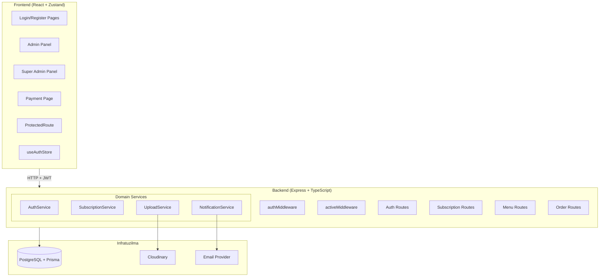
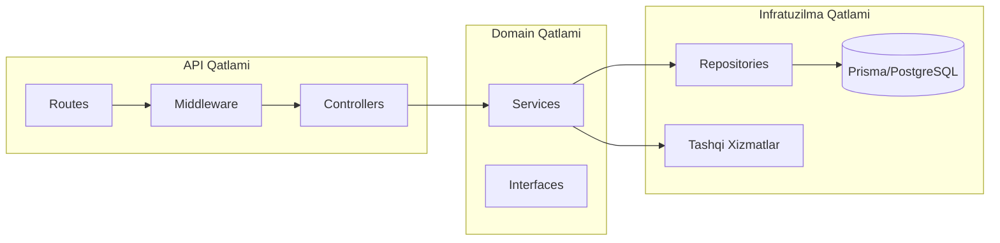
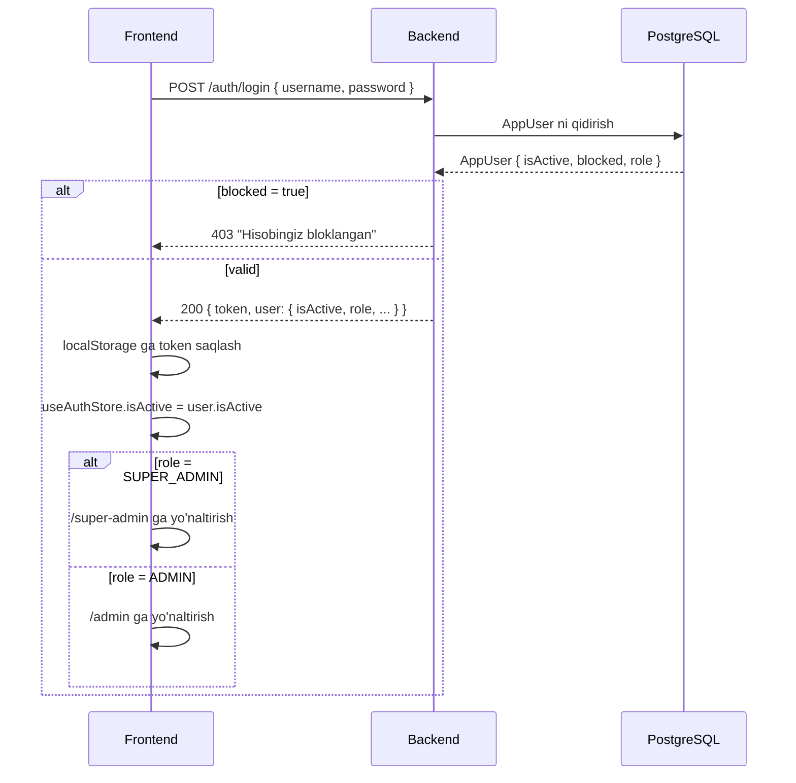
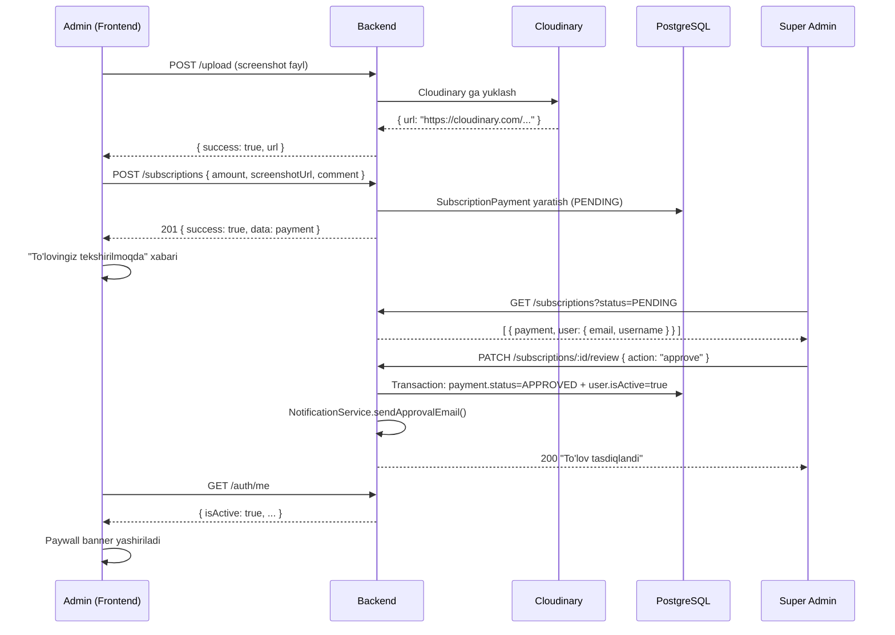
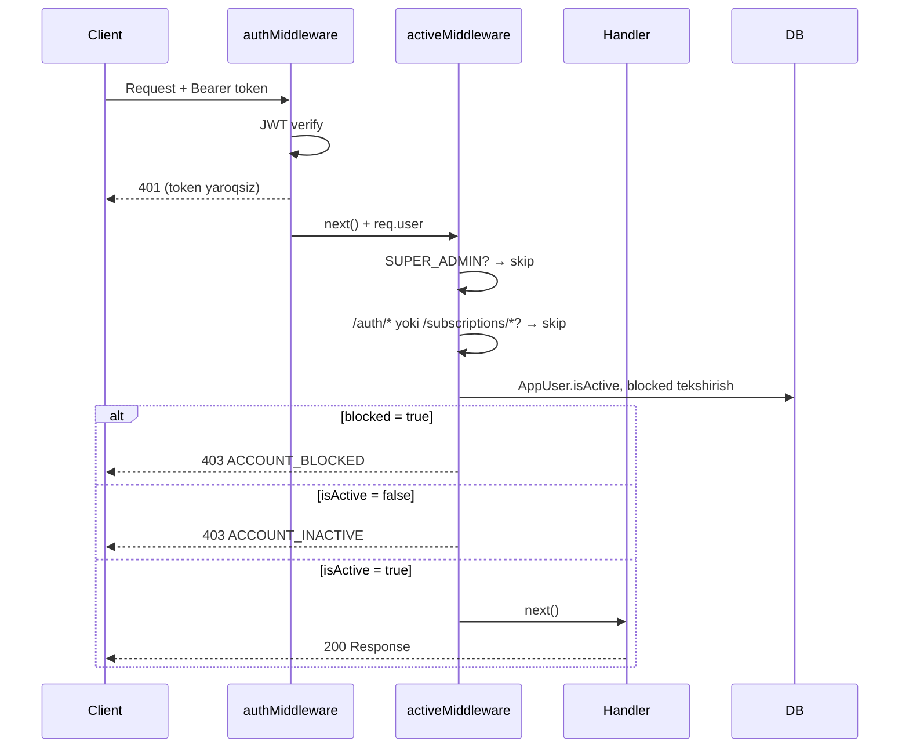

# Dizayn Hujjati: QR Menu SaaS Platformasi

## Umumiy Ko'rinish

QR Menu MVP ni to'liq production-ready SaaS platformaga aylantirish loyihasi. Platforma uch xil rol asosida ishlaydi: **Super Admin** (platforma egasi), **Admin** (restoran egasi) va **End User** (menyu ko'ruvchi mijoz).

Asosiy biznes talabi — restoran egasi to'lov qilmaguncha platformadan foydalana olmaydi (**hard paywall**). Hozircha to'lov Click / Payme orqali qo'lda amalga oshiriladi, Super Admin esa to'lovni tasdiqlaydi yoki rad etadi.

### Mavjud Texnologiyalar (o'zgartirilmaydi)

| Qatlam | Texnologiya |
|--------|-------------|
| Backend | Node.js + Express + TypeScript + Prisma + PostgreSQL |
| Frontend | React + TypeScript + Tailwind CSS + Zustand |
| Auth | JWT (AppUser modeli) |
| Rasm yuklash | Cloudinary |
| Mavjud modellar | AppUser, SubscriptionPayment |

---

## Arxitektura

### Umumiy Tizim Arxitekturasi



### Qatlam Arxitekturasi



---

## Komponentlar va Interfeyslar

### Backend Komponentlari

#### Yangi Middleware: `activeMiddleware`

```typescript
// backend/src/api/middleware/activeMiddleware.ts
export const activeMiddleware = async (req, res, next) => {
  const user = req.user; // authMiddleware dan keladi
  
  // SUPER_ADMIN har doim o'tadi
  if (user.role === 'SUPER_ADMIN') return next();
  
  // /auth/* va /subscriptions/* istisno
  if (isExemptPath(req.path)) return next();
  
  // DB dan isActive va blocked tekshirish
  const appUser = await prisma.appUser.findUnique({ where: { id: user.userId } });
  
  if (appUser?.blocked) {
    return res.status(403).json({ success: false, code: 'ACCOUNT_BLOCKED', message: 'Hisobingiz bloklangan' });
  }
  if (!appUser?.isActive) {
    return res.status(403).json({ success: false, code: 'ACCOUNT_INACTIVE', message: 'Hisobingiz faol emas. To\'lov qiling.' });
  }
  
  next();
};
```

#### Yangi Controller: `UploadController`

```typescript
// backend/src/api/controllers/UploadController.ts
// POST /upload — Cloudinary ga rasm yuklash
// Qabul qiladi: multipart/form-data (image/jpeg, image/png, image/webp)
// Qaytaradi: { success: true, url: string }
```

#### Yangi Servis: `NotificationService`

```typescript
// backend/src/domain/services/NotificationService.ts
interface INotificationService {
  sendApprovalEmail(userEmail: string, username: string): Promise<void>;
  sendRejectionEmail(userEmail: string, username: string, adminNote: string): Promise<void>;
}
```

#### Yangi Interfeys: `IPaymentProvider` (kelajak uchun)

```typescript
// backend/src/domain/services/IPaymentProvider.ts
interface IPaymentProvider {
  createPayment(amount: number, userId: string): Promise<{ paymentUrl: string; transactionId: string }>;
  verifyPayment(transactionId: string): Promise<{ status: 'PAID' | 'PENDING' | 'FAILED' }>;
  handleWebhook(payload: unknown): Promise<void>;
}
```

### Frontend Komponentlari

#### Yangi Sahifalar

| Komponent | Yo'l | Tavsif |
|-----------|------|--------|
| `PaymentPage` | `/payment` | To'lov ma'lumotlari va screenshot yuklash |
| `PaymentStatusBanner` | Admin Panel ichida | isActive holatiga qarab banner |

#### Mavjud Komponentlar (o'zgartiriladi)

| Komponent | O'zgarish |
|-----------|-----------|
| `ProtectedRoute` | `isActive` tekshiruvi qo'shiladi |
| `AdminPanel` | `isActive=false` da paywall banner, hardcoded `true` o'chiriladi |
| `SuperAdmin` | `payments` tab qo'shiladi |
| `useAuthStore` | `isActive` maydoni qo'shiladi |

---

## Ma'lumotlar Modellari

### Mavjud Modellar (o'zgartirilmaydi)

**AppUser** (schema.prisma da mavjud):
```
id, username, passwordHash, role, restaurantId, restaurantName,
ownerName, email, phone, tables, cardNumber, serviceFeePercent,
permissions, isActive (false = to'lov qilinmagan), blocked, createdAt, updatedAt
subscriptionPayments[]
```

**SubscriptionPayment** (schema.prisma da mavjud):
```
id, userId, amount, screenshotUrl, status (PENDING/APPROVED/REJECTED),
comment, adminNote, reviewedBy, reviewedAt, createdAt, updatedAt
```

### Schema Kengaytmasi (SubscriptionPayment)

`paymentMethod` maydoni qo'shiladi (Talab 13 uchun):

```prisma
model SubscriptionPayment {
  // ... mavjud maydonlar ...
  paymentMethod String @default("MANUAL") // MANUAL | CLICK | PAYME
}
```

### Zustand Store Kengaytmasi

```typescript
// useAuthStore.ts ga qo'shiladigan maydonlar
interface AuthState {
  // ... mavjud maydonlar ...
  isActive: boolean;        // backend dan olingan real qiymat
  setIsActive: (v: boolean) => void;
}
```

---

## Ma'lumotlar Oqimi

### Auth Flow



### Payment Flow



### activeMiddleware Flow



---

## API Endpointlar

### Mavjud Endpointlar (o'zgartirilmaydi)

| Method | Endpoint | Tavsif |
|--------|----------|--------|
| POST | `/auth/register` | Ro'yxatdan o'tish |
| POST | `/auth/login` | Tizimga kirish |
| GET | `/auth/me` | Joriy foydalanuvchi ma'lumotlari |
| GET | `/auth/users` | Barcha foydalanuvchilar (Super Admin) |
| POST | `/subscriptions` | To'lov yuborish |
| GET | `/subscriptions/me` | O'z to'lovlarini ko'rish |
| GET | `/subscriptions` | Barcha to'lovlar (Super Admin) |
| PATCH | `/subscriptions/:id/review` | To'lovni tasdiqlash/rad etish |
| PATCH | `/subscriptions/users/:id/block` | User block/unblock |

### Yangi Endpointlar

| Method | Endpoint | Middleware | Tavsif |
|--------|----------|------------|--------|
| POST | `/upload` | `authMiddleware` | Screenshot Cloudinary ga yuklash |
| GET | `/subscriptions/pricing` | — | Joriy obuna narxi (public) |
| PATCH | `/subscriptions/pricing` | `authMiddleware + requireRole(SUPER_ADMIN)` | Narxni yangilash |

### Endpoint Detallar

#### `POST /upload`
```
Request: multipart/form-data
  - file: File (image/jpeg, image/png, image/webp, max 5MB)
Response 200: { success: true, url: string }
Response 400: { success: false, message: "Faqat rasm fayllari qabul qilinadi" }
Response 400: { success: false, message: "Fayl hajmi 5MB dan oshmasligi kerak" }
```

#### `GET /subscriptions/pricing`
```
Response 200: { success: true, data: { monthlyPrice: number, currency: "UZS" } }
```

#### `PATCH /subscriptions/pricing`
```
Request: { monthlyPrice: number }
Response 200: { success: true, data: { monthlyPrice: number } }
```

---

## Frontend Komponent Strukturasi

```
frontend/src/
├── pages/
│   ├── Login.tsx              (mavjud — o'zgartirilmaydi)
│   ├── Register.tsx           (mavjud — o'zgartirilmaydi)
│   ├── AdminPanel.tsx         (mavjud — isActive hardcode o'chiriladi)
│   ├── SuperAdmin.tsx         (mavjud — payments tab qo'shiladi)
│   └── PaymentPage.tsx        (YANGI)
├── components/
│   ├── ProtectedRoute.tsx     (mavjud — isActive tekshiruvi qo'shiladi)
│   ├── PaymentStatusBanner.tsx (YANGI — paywall banner)
│   └── PaymentHistory.tsx     (YANGI — to'lov tarixi)
├── store/
│   └── useAuthStore.ts        (mavjud — isActive maydoni qo'shiladi)
└── lib/
    └── api.ts                 (mavjud — upload, pricing endpointlar qo'shiladi)
```

### PaymentPage Komponent Tuzilishi

```
PaymentPage
├── Header (email readonly)
├── PricingCard (dinamik narx — GET /subscriptions/pricing)
├── PaymentInstructions (Click/Payme karta raqamlari)
├── ScreenshotUploader
│   ├── FileInput (image/* only, max 5MB)
│   ├── Preview
│   └── UploadProgress
├── CommentField (ixtiyoriy)
└── SubmitButton → POST /subscriptions
```

### PaymentStatusBanner Holatlari

```
isActive = false + hech qanday to'lov yo'q:
  → "To'lov qilish" CTA + /payment ga yo'naltirish

isActive = false + PENDING to'lov mavjud:
  → "To'lovingiz tekshirilmoqda. 1-24 soat ichida faollashadi."

isActive = false + REJECTED to'lov:
  → "To'lovingiz rad etildi: {adminNote}" + yangi to'lov yuborish

isActive = true:
  → Banner ko'rsatilmaydi
```

---

## Backend Servis va Middleware Arxitekturasi

### Middleware Zanjiri

```
Request
  → cors()
  → express.json()
  → authMiddleware (JWT verify)
  → activeMiddleware (isActive/blocked tekshirish)
  → requireRole() (rol tekshirish)
  → Controller
```

### Servis Qatlami

```
SubscriptionService
  ├── submitPayment(userId, amount, screenshotUrl, comment)
  ├── getMyPayments(userId)
  ├── getAllPayments(filters)
  ├── reviewPayment(paymentId, action, adminNote, reviewerId)
  │     └── prisma.$transaction([updatePayment, updateUser])
  │     └── NotificationService.send*Email()
  └── toggleBlock(userId)

UploadService (adapter pattern)
  ├── interface IStorageProvider { upload(file): Promise<string> }
  ├── CloudinaryProvider implements IStorageProvider
  └── S3Provider implements IStorageProvider (kelajak uchun)

NotificationService
  ├── sendApprovalEmail(email, username)
  └── sendRejectionEmail(email, username, adminNote)
  (xato bo'lsa log qiladi, tranzaksiyani bekor qilmaydi)

PricingService
  ├── getPrice(): Promise<number>
  └── updatePrice(amount): Promise<void>
  (DB yoki config faylda saqlanadi)
```

---

## Xavfsizlik Yondashuvi

### Autentifikatsiya va Avtorizatsiya

- Barcha himoyalangan endpointlar `authMiddleware` orqali o'tadi (JWT verify)
- `activeMiddleware` to'lov qilinmagan adminlarni bloklaydi
- `requireRole()` rol asosida kirish nazoratini ta'minlaydi
- Bloklangan foydalanuvchilar login qilolmaydi (AuthService da tekshiriladi)

### Ma'lumot Xavfsizligi

- Parollar `bcrypt` (salt rounds: 10) bilan hash qilinadi
- JWT token `localStorage` da saqlanadi (XSS xavfi — kelajakda httpOnly cookie ga o'tish tavsiya etiladi)
- Cloudinary URL lar `@db.Text` sifatida saqlanadi (uzun URL lar uchun)
- Fayl yuklashda MIME type va hajm tekshiriladi

### API Xavfsizligi

- CORS sozlamalari frontend domeniga cheklangan
- Rate limiting (mavjud `RateLimitLog` modeli orqali)
- Input validatsiya barcha controllerlarda

### Paywall Xavfsizligi

- Paywall faqat frontend da emas, backend middleware darajasida ham ishlaydi
- `isActive` qiymati har so'rovda DB dan tekshiriladi (JWT da emas)
- Super Admin har doim barcha endpointlarga kirish huquqiga ega

---

## Kengaytirilish Imkoniyatlari (Click/Payme)

### IPaymentProvider Interfeysi

```typescript
// backend/src/domain/services/IPaymentProvider.ts
interface IPaymentProvider {
  name: 'MANUAL' | 'CLICK' | 'PAYME';
  createPayment(params: {
    amount: number;
    userId: string;
    orderId: string;
    returnUrl: string;
  }): Promise<{ paymentUrl: string; transactionId: string }>;
  
  verifyPayment(transactionId: string): Promise<{
    status: 'PAID' | 'PENDING' | 'FAILED';
    amount: number;
  }>;
  
  handleWebhook(payload: unknown, signature: string): Promise<{
    transactionId: string;
    status: 'PAID' | 'FAILED';
  }>;
}
```

### Webhook Endpoint (kelajak uchun)

```
POST /webhooks/click   → ClickProvider.handleWebhook()
POST /webhooks/payme   → PaymeProvider.handleWebhook()
```

### SubscriptionPayment Kengaytmasi

```prisma
model SubscriptionPayment {
  // ... mavjud maydonlar ...
  paymentMethod  String  @default("MANUAL") // MANUAL | CLICK | PAYME
  transactionId  String? @unique            // Gateway transaction ID
  gatewayData    Json?                      // Gateway specific data
}
```

### Migratsiya Strategiyasi

1. Hozir: `ManualPaymentProvider` — screenshot + Super Admin tasdiqlash
2. Keyinroq: `ClickProvider` yoki `PaymeProvider` qo'shiladi
3. `PaymentService` factory pattern orqali provider tanlaydi
4. Mavjud `SubscriptionPayment` yozuvlari o'zgartirilmaydi

---

## To'g'rilik Xususiyatlari

*Xususiyat — tizimning barcha to'g'ri bajarilishlarida rost bo'lishi kerak bo'lgan xarakteristika yoki xatti-harakat. Xususiyatlar inson o'qiydigan spetsifikatsiyalar va mashina tomonidan tekshiriladigan to'g'rilik kafolatlari o'rtasidagi ko'prik vazifasini bajaradi.*

### Xususiyat 1: Ro'yxatdan o'tish to'g'riligi

*Har qanday* valid (noyob username, 6+ belgili parol) ro'yxatdan o'tish so'rovi uchun, yaratilgan AppUser `role = ADMIN`, `isActive = false`, `blocked = false` qiymatlariga ega bo'lishi va JWT token qaytarilishi kerak.

**Validates: Requirements 1.1, 1.2, 1.5**

### Xususiyat 2: Takroriy username rad etilishi

*Har qanday* allaqachon mavjud username bilan ro'yxatdan o'tishga urinish 400 xato qaytarishi kerak va yangi AppUser yaratilmasligi kerak.

**Validates: Requirements 1.3**

### Xususiyat 3: Parol uzunligi validatsiyasi

*Har qanday* 6 belgidan qisqa parol bilan ro'yxatdan o'tishga urinish 400 xato qaytarishi kerak.

**Validates: Requirements 1.4**

### Xususiyat 4: Login round trip

*Har qanday* ro'yxatdan o'tgan foydalanuvchi uchun, ro'yxatdan o'tishda ishlatilgan username va parol bilan login qilish JWT token va to'g'ri foydalanuvchi ma'lumotlarini qaytarishi kerak.

**Validates: Requirements 2.1**

### Xususiyat 5: Noto'g'ri login rad etilishi

*Har qanday* mavjud bo'lmagan username yoki noto'g'ri parol bilan login qilishga urinish 401 xato qaytarishi kerak.

**Validates: Requirements 2.2**

### Xususiyat 6: activeMiddleware bloklash

*Har qanday* `isActive = false` bo'lgan foydalanuvchi tomonidan `/auth/*` va `/subscriptions/*` dan tashqari himoyalangan endpointga yuborilgan so'rov 403 `ACCOUNT_INACTIVE` xatosi bilan rad etilishi kerak.

**Validates: Requirements 3.1, 3.2, 10.1, 10.2, 10.3**

### Xususiyat 7: To'lov yaratish round trip

*Har qanday* valid to'lov ma'lumotlari (amount > 0, screenshotUrl) bilan yuborilgan to'lov `GET /subscriptions/me` orqali `PENDING` holatda olinishi kerak.

**Validates: Requirements 4.9, 6.1, 6.2**

### Xususiyat 8: Takroriy PENDING to'lov rad etilishi

*Har qanday* foydalanuvchi uchun, allaqachon `PENDING` holatdagi to'lov mavjud bo'lsa, yangi to'lov yuborish 400 xato qaytarishi kerak.

**Validates: Requirements 4.10**

### Xususiyat 9: Rasm formati validatsiyasi

*Har qanday* rasm bo'lmagan fayl (image/jpeg, image/png, image/webp dan tashqari) yuklashga urinish 400 xato qaytarishi kerak; valid rasm formatlari esa Cloudinary URL qaytarishi kerak.

**Validates: Requirements 4.6, 5.2, 5.3**

### Xususiyat 10: Approve to'g'riligi

*Har qanday* `PENDING` holatdagi to'lovni approve qilganda, `SubscriptionPayment.status = APPROVED` va tegishli `AppUser.isActive = true` bitta tranzaksiyada o'rnatilishi kerak.

**Validates: Requirements 7.5**

### Xususiyat 11: Takroriy review rad etilishi

*Har qanday* `PENDING` bo'lmagan (APPROVED yoki REJECTED) to'lovni qayta review qilishga urinish 400 xato qaytarishi kerak.

**Validates: Requirements 7.7**

### Xususiyat 12: Status filtrlash to'g'riligi

*Har qanday* `?status=X` filtri bilan `GET /subscriptions` so'rovida qaytarilgan barcha to'lovlar faqat `X` statusiga ega bo'lishi kerak.

**Validates: Requirements 7.2**

---

## Xato Boshqaruvi

### Backend Xato Kodlari

| Kod | HTTP Status | Holat |
|-----|-------------|-------|
| `ACCOUNT_INACTIVE` | 403 | isActive = false |
| `ACCOUNT_BLOCKED` | 403 | blocked = true |
| `DUPLICATE_USERNAME` | 400 | Username band |
| `INVALID_PASSWORD` | 400 | Parol qisqa |
| `PAYMENT_PENDING` | 400 | PENDING to'lov mavjud |
| `PAYMENT_REVIEWED` | 400 | To'lov allaqachon ko'rib chiqilgan |
| `INVALID_FILE_TYPE` | 400 | Rasm bo'lmagan fayl |
| `FILE_TOO_LARGE` | 400 | 5MB dan katta fayl |

### Frontend Xato Boshqaruvi

- `401` → auto logout + `/login` ga yo'naltirish (axios interceptor)
- `403 ACCOUNT_INACTIVE` → paywall banner ko'rsatish
- `403 ACCOUNT_BLOCKED` → "Hisobingiz bloklangan" xabari
- `400` → toast notification bilan xato xabari
- Network xato → "Ulanish xatosi" toast

### Email Xato Boshqaruvi

Email yuborish muvaffaqiyatsiz bo'lsa:
- Xato `logger.error()` bilan log qilinadi
- Asosiy tranzaksiya (approve/reject) bekor qilinmaydi
- Foydalanuvchiga ko'rsatiladigan javob o'zgarmaydi

---

## Test Strategiyasi

### Birlik Testlari (Unit Tests)

**Backend:**
- `AuthService`: login, register, validatsiya
- `SubscriptionService`: submitPayment, reviewPayment, toggleBlock
- `activeMiddleware`: turli rol va isActive holatlari
- `UploadService`: fayl validatsiyasi (MIME type, hajm)
- `NotificationService`: email yuborish (mock bilan)

**Frontend:**
- `PaymentPage`: forma validatsiyasi, fayl yuklash
- `PaymentStatusBanner`: turli holatlarda to'g'ri UI
- `useAuthStore`: isActive holati boshqaruvi

### Xususiyat Asosidagi Testlar (Property-Based Tests)

Property-based testing uchun **fast-check** (TypeScript) kutubxonasi ishlatiladi. Har bir test kamida **100 iteratsiya** bilan ishga tushiriladi.

**Test teglari formati:** `Feature: qr-menu-saas-platform, Property {N}: {property_text}`

```typescript
// Xususiyat 1: Ro'yxatdan o'tish to'g'riligi
fc.assert(fc.asyncProperty(
  fc.record({ username: fc.string({ minLength: 3 }), password: fc.string({ minLength: 6 }), ... }),
  async (data) => {
    const res = await authService.register(data);
    expect(res.user.isActive).toBe(false);
    expect(res.user.role).toBe('ADMIN');
    expect(res.token).toBeTruthy();
  }
), { numRuns: 100 });
// Feature: qr-menu-saas-platform, Property 1: Ro'yxatdan o'tish to'g'riligi
```

```typescript
// Xususiyat 6: activeMiddleware bloklash
fc.assert(fc.asyncProperty(
  fc.constantFrom('/menu', '/orders', '/waiters', '/menu/categories'),
  async (endpoint) => {
    const res = await request(app)
      .get(endpoint)
      .set('Authorization', `Bearer ${inactiveUserToken}`);
    expect(res.status).toBe(403);
    expect(res.body.code).toBe('ACCOUNT_INACTIVE');
  }
), { numRuns: 100 });
// Feature: qr-menu-saas-platform, Property 6: activeMiddleware bloklash
```

### Integratsiya Testlari

- Email yuborish (mock email provider bilan)
- Cloudinary yuklash (mock bilan)
- Prisma tranzaksiyalar (test DB bilan)

### Smoke Testlar

- `IPaymentProvider` interfeysi mavjudligi
- Barcha yangi endpointlar 404 qaytarmasligi
- Middleware zanjiri to'g'ri tartibda ulanganligi
